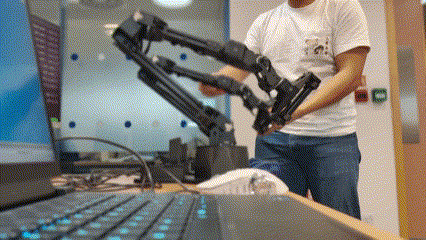
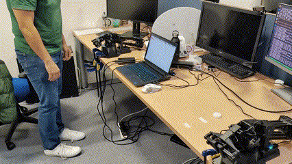
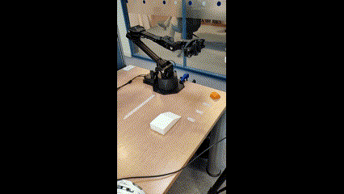

# Overview

Welcome to Telesofia! This repository contains the files utilized for teleoperation of a robotic arm and for demonstration data collection, as well as running learnt AI policies using Imitation Learning. The end goal was to have a system capable of capturing real-world demonstrations and learning to perform specific tasks based on these demonstrations.

The system features a teleoperation mode, which enables one robotic arm to replicate the actions of the other, allowing the operator to remotely manipulate the other robot arm. The objective of teleoperation is to eliminate the presence of the operator in the camera captures, as it will not be present when running the policies. The system also features a data collection mode, where it records the actions taken and video of the robot solving a task while being teleoperated. Finally, the policy execution mode enables us to run policies trained on the provided demonstrations.

Files to train new policies can be found in: https://github.com/CharlieV1lla/sofiaPolicies

## Teleoperation

## Data collection

## Policy execution

## Source Material

This repository develops on the work done here: https://github.com/tonyzhaozh/aloha

Trossen Robotics packages for robot manipulation: https://github.com/Interbotix/interbotix_ros_manipulators/tree/main/interbotix_ros_xsarms

## Credits

Author: Carlos Ignacio Villalobos Sanchez

Special thanks to my supervisor Andrew Davison, to Marwan Taher and all the members of the Dyson Robotics Laboratory for making me feel welcome and for all the help provided throughout the project.

## Contact

carlosvillalobos.githbub@gmail.com

